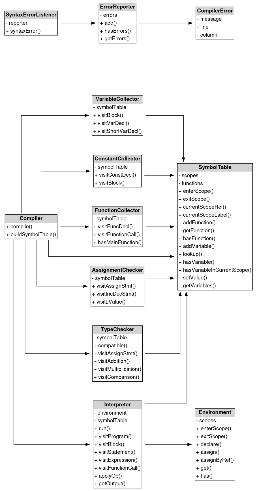
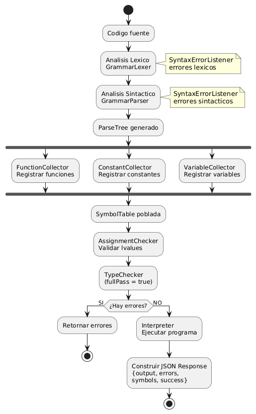

# Documentación Técnica — Intérprete Golampi

---


## Gramática Formal de Golampi

La gramática de Golampi está definida en formato ANTLR4. A continuación se presenta en notación BNF/EBNF para mayor claridad.

### Programa y Declaraciones Globales

```
program
    : globalDeclaration* EOF

globalDeclaration
    : funcDecl
    | varDecl
    | constDecl

funcDecl
    : 'func' ID '(' paramList? ')' returnType? block

paramList
    : paramGroup (',' paramGroup)*

paramGroup
    : ID+ typeLiteral
    | '&' ID typeLiteral         // parámetro por referencia
    | '*' ID typeLiteral         // parámetro puntero

returnType
    : typeLiteral
    | '(' typeLiteral (',' typeLiteral)* ')'   // retorno múltiple
```

### Sentencias

```
statement
    : varDecl
    | constDecl
    | shortVarDecl
    | assignStmt
    | incDecStmt
    | ifStmt
    | forStmt
    | switchStatement
    | returnStatement
    | breakStmt
    | continueStmt
    | fmtPrintln
    | functionCall ';'?
    | block

block
    : '{' statement* '}'

shortVarDecl
    : idList ':=' expressionList

varDecl
    : 'var' idList (typeLiteral | arrayTypeLiteral) ('=' expressionList)?

constDecl
    : 'const' ID typeLiteral? '=' expression
```

### Control de Flujo

```
ifStmt
    : 'if' expression block ('else' (ifStmt | block))?

forStmt
    : 'for' forHeader block

forHeader
    : expression                                   // condición simple
    | forInitialization ';' expression ';' forPost // C-style

forInitialization
    : shortVarDecl
    | assignStmt

forPost
    : assignStmt
    | incDecStmt

switchStatement
    : 'switch' expression '{' switchCase* defaultCase? '}'

switchCase
    : 'case' expression ':' statement*

defaultCase
    : 'default' ':' statement*

returnStatement
    : 'return' expressionList?

breakStmt    : 'break'
continueStmt : 'continue'
```

### Expresiones

```
expression
    : expression ('||') expression
    | expression ('&&') expression
    | expression ('==' | '!=' | '<' | '<=' | '>' | '>=') expression
    | expression ('+' | '-') expression
    | expression ('*' | '/' | '%') expression
    | unary

unary
    : ('!' | '-' | '&' | '*') unary
    | primaryExpr

primaryExpr
    : operand
    | primaryExpr '[' expression ']'   // índice de arreglo
    | functionCall
    | lenCall
    | nowCall
    | substrCall
    | typeOfCall

operand
    : ID
    | literal
    | '(' expression ')'

literal
    : INT_LIT
    | FLOAT_LIT
    | STRING_LIT
    | BOOL_LIT
    | NIL_LIT
    | arrayLiteral

arrayLiteral
    : '[' INT_LIT ']' typeLiteral '{' expressionList? '}'
    | arrayTypeLiteral '{' (arrayLiteral (',' arrayLiteral)*)? '}'
```

### Tipos

```
typeLiteral
    : 'int32' | 'float64' | 'string' | 'bool' | 'nil'
    | '*' typeLiteral      // puntero
    | '[' INT_LIT ']' typeLiteral   // arreglo de tamaño fijo

arrayTypeLiteral
    : '[' expression ']' ('[' expression ']')* typeLiteral
```

###  Funciones Integradas

```
fmtPrintln  : 'fmt.Println' '(' expressionList? ')'
lenCall     : 'len' '(' expression ')'
nowCall     : 'time.Now().Format' '(' expression ')'
substrCall  : 'substr' '(' expression ',' expression ',' expression ')'
typeOfCall  : 'typeOf' '(' expression ')'
```

### Tokens Léxicos

```
ID          : [a-zA-Z_][a-zA-Z0-9_]*
INT_LIT     : [0-9]+
FLOAT_LIT   : [0-9]+ '.' [0-9]+
STRING_LIT  : '"' (~["\r\n] | '\\' .)* '"'
BOOL_LIT    : 'true' | 'false'
NIL_LIT     : 'nil'
COMMENT     : '//' ~[\r\n]* -> skip
BLOCK_CMT   : '/*' .*? '*/' -> skip
WS          : [ \t\r\n]+ -> skip
```

---
## Arquitectura del Intérprete

Golampi utiliza un **intérprete basado en el patrón Visitor** sobre el ParseTree generado por ANTLR4.

El proceso sigue los siguientes pasos:

1. El **Lexer** convierte el código fuente en tokens.
2. El **Parser** construye el ParseTree.
3. Los **Visitors semánticos** recorren el árbol para construir la tabla de símbolos y validar el programa.
4. El **Interpreter** ejecuta el árbol evaluando cada nodo.

Esta arquitectura permite separar claramente:

- Análisis sintáctico
- Análisis semántico
- Ejecución

---

##  Diagrama de Clases




---

## Clases Principales del Sistema

A continuación se describen las clases más importantes dentro de la arquitectura del intérprete Golampi.


### Compiler

```php
class Compiler
{
    public function compile(string $input): array
    {
        $errorReporter = new ErrorReporter();
        $symbolTable   = new SymbolTable();
        $typeChecker   = new TypeChecker($symbolTable, $errorReporter);

        $inputStream = InputStream::fromString($input);
        $lexer       = new GrammarLexer($inputStream);
        $tokenStream = new CommonTokenStream($lexer);
        $parser      = new GrammarParser($tokenStream);

       ...
    
}
```

La clase **Compiler** es la encargada de **orquestar todo el proceso de compilación y ejecución** del programa.

Responsabilidades principales:

- Crear el **lexer y parser de ANTLR**
- Construir el **árbol sintáctico (AST)**
- Ejecutar las distintas fases de análisis semántico
- Invocar el **intérprete** para ejecutar el programa

### SymbolTable

```php
class SymbolTable {
    private array $scopes      = [];
    private array $scopeLabels = [];

    public function __construct() {
        $this->enterScope('global');
    } 
    ...
```

La clase **SymbolTable** representa la **tabla de símbolos del programa**.

Su función es almacenar información sobre:

- variables
- constantes
- funciones
- ámbitos (scopes)

La tabla de símbolos utiliza una **estructura de pila de scopes** para manejar correctamente la visibilidad de variables dentro de bloques y funciones.

Responsabilidades:

- Registrar símbolos
- Buscar identificadores
- Manejar scopes anidados
- Mantener referencias a funciones

Métodos importantes:

| Método | Descripción |
|------|------|
| `enterScope()` | Crea un nuevo ámbito |
| `exitScope()` | Sale del ámbito actual |
| `addVariable()` | Registra una variable en la tabla |
| `lookup()` | Busca un símbolo en los scopes activos |
| `addFunction()` | Registra una función |

---

### Interpreter

```php
class Interpreter extends GrammarBaseVisitor {

    private Environment $env;
    private SymbolTable $symbolTable; 
    private string $output = "";      

    public function __construct(SymbolTable $symbolTable) {
        $this->symbolTable = $symbolTable;
        $this->env = new Environment();
    }

    ...
```

La clase **Interpreter** ejecuta el programa recorriendo el **árbol sintáctico abstracto (AST)** generado por ANTLR.

Esta clase extiende `GrammarBaseVisitor`.

Responsabilidades:

- Evaluar expresiones
- Ejecutar sentencias
- Manejar llamadas a funciones
- Ejecutar estructuras de control
- Generar la salida del programa

Componentes que utiliza:

- `SymbolTable`
- `Environment`

Métodos importantes:

| Método | Descripción |
|------|------|
| `run()` | Inicia la ejecución del programa |
| `visitProgram()` | Punto de entrada del programa |
| `visitBlock()` | Ejecuta bloques de código |
| `visitExpression()` | Evalúa expresiones |
| `visitFunctionCall()` | Ejecuta llamadas a funciones |

---

### Environment

La clase **Environment** representa el **estado de ejecución del programa**.

Mientras que la **SymbolTable** almacena información sobre tipos y metadatos, el **Environment** guarda **los valores reales de las variables durante la ejecución**.

Responsabilidades:

- Almacenar valores de variables
- Manejar scopes de ejecución
- Permitir asignaciones y lecturas de variables

Métodos importantes:

| Método | Descripción |
|------|------|
| `declare()` | Declara una variable en el entorno |
| `assign()` | Asigna un valor a una variable |
| `get()` | Obtiene el valor actual de una variable |
| `enterScope()` | Crea un nuevo ámbito de ejecución |

---

## Visitors Semánticos

Los **Visitors** implementan las diferentes fases del análisis semántico del lenguaje.

Todos extienden la clase generada por ANTLR:


```
GrammarBaseVisitor  (generado por ANTLR4)
        │
        ├── FunctionCollector
        │       Registra funciones en SymbolTable (hoisting)
        │
        ├── ConstantCollector
        │       Registra constantes globales
        │
        ├── VariableCollector
        │       Registra variables con tipo, línea y ámbito
        │       Depende de: TypeChecker (inferencia de tipos)
        │
        ├── AssignmentChecker
        │       Valida asignaciones y uso de identificadores
        │
        ├── TypeChecker
        │       fullPass=false → solo inferencia de tipos
        │       fullPass=true  → validación completa
        │
        └── Interpreter
                Ejecuta el árbol sintáctico
                Depende de: SymbolTable, Environment
```


---

## Flujo de Procesamiento




##  Tabla de Símbolos

### Estructura de un Símbolo

Cada entrada en la tabla de símbolos almacena:

| Campo   | Tipo    | Descripción                                              |
|---------|---------|----------------------------------------------------------|
| `type`  | string  | Tipo de dato (`int32`, `float64`, `string`, `bool`, etc.)|
| `kind`  | string  | Clase del símbolo: `var`, `const`, `function`            |
| `line`  | int     | Línea de declaración en el código fuente                 |
| `scope` | string  | Ámbito: `global`, `func:nombre`, `block`, `loop`         |
| `value` | mixed   | Valor final tras la ejecución (null si no ejecutado)     |


---

##  Manejo de Errores

### Tipos de Error

| Tipo              | Fase      | Ejemplos                                      |
|-------------------|-----------|-----------------------------------------------|
| Error Léxico      | Léxica    | Caracteres no reconocidos (`@`, `#`)          |
| Error Sintáctico  | Sintáctica| Construcciones incompletas, tokens inesperados|
| Error Semántico   | Semántica | Variable no declarada, reutilización de ID    |
| Error de Tipo     | Semántica | Asignación de tipos incompatibles             |
| Error Interno     | Runtime   | Excepciones no capturadas en el intérprete    |

### 6.2 Estructura de un Error

```json
{
  "tipo":        "Error Semántico",
  "descripcion": "La variable 'x' no está declarada.",
  "linea":       10,
  "columna":     4
}
```

### Señales de Control en el Intérprete

El intérprete usa excepciones PHP para el flujo de control sin considerarlas errores:

```
ReturnSignal  → capturada en callFunction()
BreakSignal   → capturada en visitForStmt(), visitSwitchStatement()
ContinueSignal→ capturada en visitForStmt()
```

---

## Generacion de Código Ensamblador (ARM64)
A partir de la fase semántica, el compilador de Golampi genera código ensamblador ARM64 (AArch64) utilizando un Visitor especializado.

Esta funcionalidad transforma el árbol sintáctico en instrucciones de bajo nivel ejecutables en arquitectura ARM.

### Arquitectura de Generación de Código
El proceso de generación sigue este flujo:

Se recorre el AST con el visitor CodeGenerator
Se generan instrucciones ensamblador línea por línea
Se construyen dos secciones:
.data → almacenamiento de strings
.text → código ejecutable
Se agregan funciones auxiliares (runtime)
Se produce el archivo final .s

### CodeGenerator
La clase CodeGenerator es responsable de traducir el AST a instrucciones ARM64.

**Responsabilidades**
- Generar instrucciones ARM64
- Manejar stack frame de funciones
- Traducir expresiones y control de flujo
- Administrar registros
- Generar labels únicos
- Construir sección .data para strings
- Implementar funciones runtime

### Convenciones de ARM64 utilizadas
El generador sigue convenciones estándar de la arquitectura:

- x0 - x7 → argumentos de funciones
- x0 → valor de retorno
- x29 → frame pointer
- x30 → link register
- sp → stack pointer

Además:

- x19 - x21 se usan como registros temporales preservados
- s0 se usa para floats

### Manejo de funciones

Cada función genera:

**Prólogo**
```
sub sp, sp, #frameSize
stp x29, x30, [sp, #0]
mov x29, sp
```
**Epilogo**
```
ldp x29, x30, [sp, #0]
add sp, sp, #frameSize
ret
```