# Manual de Usuario — Intérprete Golampi


---

## 1. Requisitos del Sistema

| Componente | Versión mínima |
|------------|----------------|
| PHP        | 8.1 o superior |
| Composer   | 2.x            |
| Navegador  | Chrome 100+, Firefox 100+, Edge 100+ |
| Sistema operativo | Linux, macOS o Windows (WSL recomendado) |

---

## Instalación

### Clonar el repositorio

```bash
git clone <link del repo>
cd OLC2_P1_<carnet>
```

### Instalar dependencias del backend

```bash
cd backend
composer install
cd ..
```

Esto instalará el runtime de ANTLR4 para PHP y todas las dependencias necesarias.

###  Verificar la instalación

```bash
php --version        # debe mostrar PHP 8.1 o superior
composer --version   # debe mostrar Composer 2.x
```

---

##  Iniciar la Herramienta

La herramienta requiere **dos servidores** corriendo simultáneamente: el backend (API) y el frontend (interfaz).

###  Iniciar el backend 

Abrir una terminal y ejecutar:

```bash
cd backend
php -S localhost:8000 -t public/
```

Deberá ver:
```
PHP 8.x Development Server (http://localhost:8000) started
```

### Iniciar el frontend (IDE)

Abrir **otra terminal** y ejecutar:

```bash
cd frontend
php -S localhost:3000
```

Deberá ver:
```
PHP 8.x Development Server (http://localhost:3000) started
```

###  Abrir el IDE en el navegador

Navegar a:
```
http://localhost:3000
```

> **Importante:** Ambos servidores deben estar activos para que el IDE funcione correctamente. El backend en el puerto `8000` procesa el código; el frontend en el puerto `3000` sirve la interfaz.

---

##  Interfaz de Usuario

La interfaz está dividida en dos paneles principales:

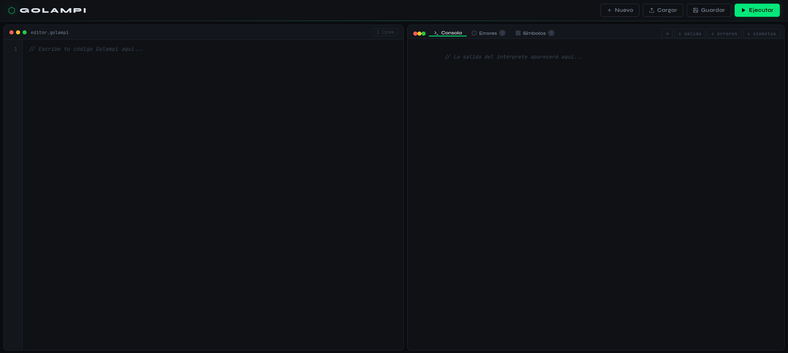

### Barra de herramientas (encabezado)

| Botón      | Función                                                  |
|------------|----------------------------------------------------------|
| **Nuevo**  | Limpia el editor y la consola para comenzar desde cero  |
| **Cargar** | Abre un archivo `.go`, `.golampi` o `.txt` desde el disco|
| **Guardar**| Descarga el contenido del editor como `programa.golampi` |
| **▶ Ejecutar** | Envía el código al backend para compilar y ejecutar  |

> **Atajo de teclado:** `Ctrl + Enter` ejecuta el programa sin necesidad de hacer clic.

### Panel izquierdo — Editor

- Área de texto con numeración de líneas automática.
- Soporta indentación con la tecla `Tab` (4 espacios).
- El contador en la esquina superior derecha muestra el total de líneas.


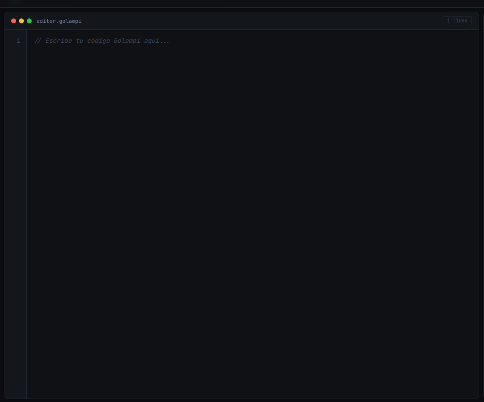


###  Panel derecho — Salida y Reportes

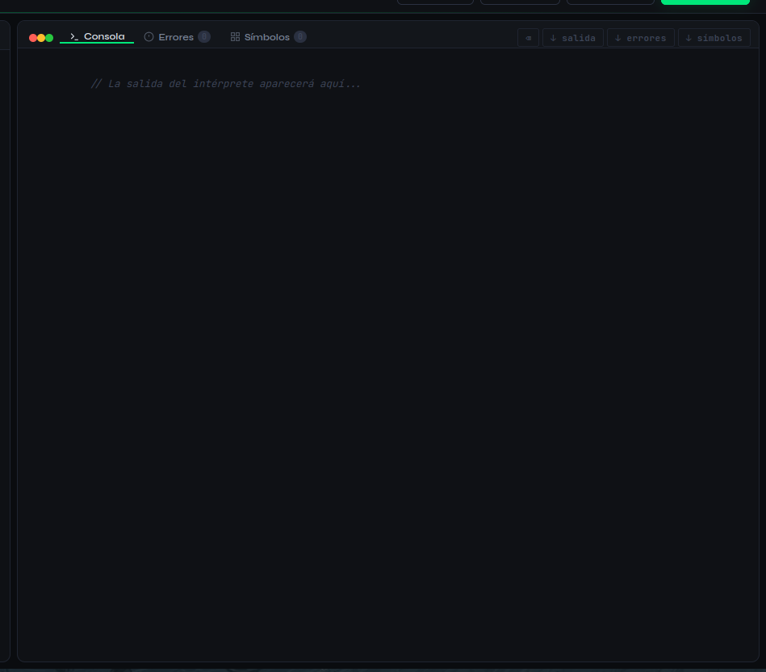


El panel derecho tiene tres vistas navegables mediante los botones en su encabezado:

| Vista       | Descripción                                              |
|-------------|----------------------------------------------------------|
| **Consola** | Muestra la salida del programa (`fmt.Println`)           |
| **Errores** | Tabla con todos los errores detectados                   |
| **Símbolos**| Tabla de símbolos con variables, constantes y funciones  |

El número junto a cada botón indica la cantidad de elementos (ej: `Errores 3`).

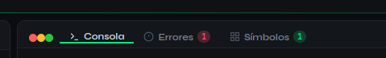

---

##  Crear y Editar Código

### Escribir código directamente

Haga clic en el editor (panel izquierdo) y comience a escribir. El mínimo programa válido en Golampi es:

```go
func main() {
    fmt.Println("¡Hola, Golampi!")
}
```


### Limpiar el editor

Haga clic en **Nuevo** en la barra de herramientas. Si hay contenido, el sistema pedirá confirmación antes de limpiar.


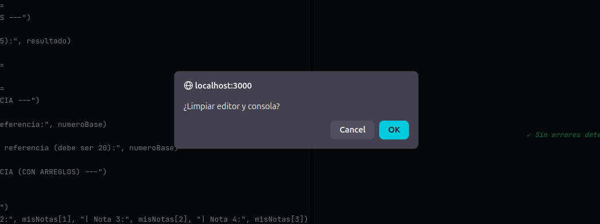

---

##  Ejecutar Programas

### Pasos para ejecutar

1. Escriba o cargue su código en el editor.
2. Haga clic en el botón **Ejecutar** 
3. Aparecerá un indicador de carga mientras el backend procesa el código.
4. El resultado aparecerá automáticamente en la vista **Consola**.

### Indicador de estado

Tras la ejecución, aparecerá un mensaje en la esquina inferior derecha:

| Mensaje                | Significado                              |
|------------------------|------------------------------------------|
| `Compilación exitosa`| El programa se ejecutó sin errores       |
| `N error(es)`        | Se detectaron errores semánticos o de tipo|
| `Error de conexión`  | El backend no está disponible            |

---

##  Interpretar la Consola de Salida

La consola muestra la salida producida por `fmt.Println` durante la ejecución.

###  Colores de la consola

| Color  | Significado                          |
|--------|--------------------------------------|
| Verde  | Salida normal del programa           |
| Rojo   | Errores detectados durante el análisis|
| Azul   | Mensajes informativos del sistema    |

### Ejemplo de salida exitosa


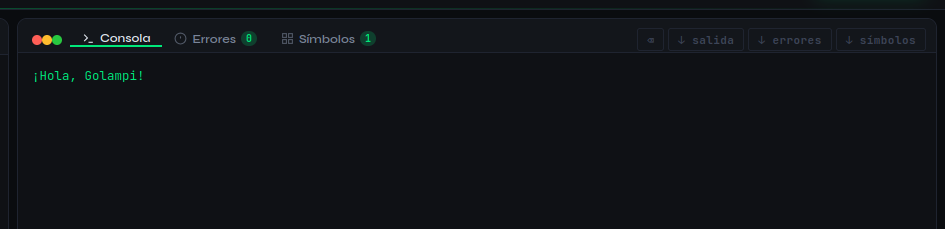

### Ejemplo de salida con errores

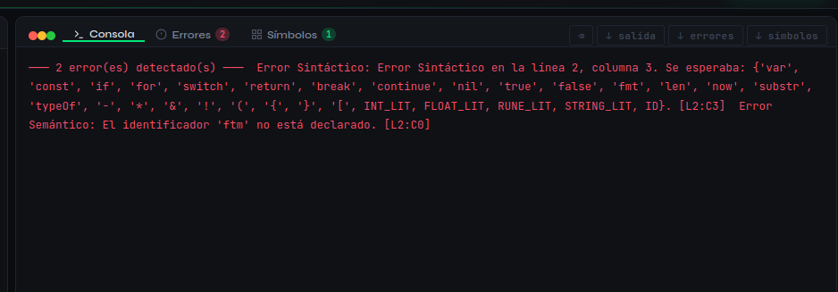

### Botón limpiar

El botón en el encabezado del panel derecho limpia únicamente la consola, sin afectar el editor.


---

##  Reporte de Errores

Para ver el reporte de errores, haga clic en el botón **Errores** en el encabezado del panel derecho.

### Columnas de la tabla

| Columna       | Descripción                                              |
|---------------|----------------------------------------------------------|
| **TIPO**      | Categoría del error (Léxico, Sintáctico, Semántico, etc.)|
| **DESCRIPCIÓN**| Mensaje explicativo del error                           |
| **LÍNEA**     | Número de línea donde ocurrió el error                   |
| **COL**       | Número de columna dentro de esa línea                    |

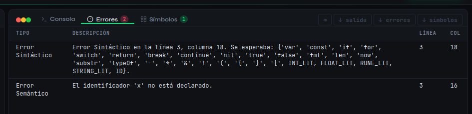

### Cómo leer un error

Ejemplo: `Error Semántico | La variable 'x' no está declarada. | 3| 16`

Significa que en la **línea 3,columna 4** el código se usó la variable `x` sin haberla declarado previamente.

### Descargar el reporte

Haga clic en **errores** para descargar la tabla como archivo HTML que puede abrir en cualquier navegador.

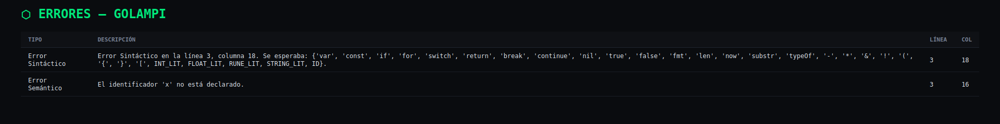

---

##  Tabla de Símbolos

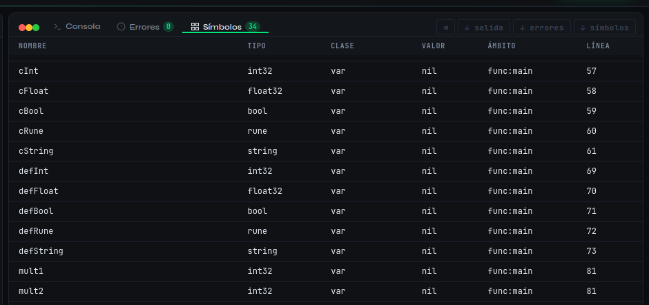


Para ver la tabla de símbolos, haga clic en el botón **Símbolos** en el encabezado del panel derecho.

### Columnas de la tabla

| Columna      | Descripción                                                    |
|--------------|----------------------------------------------------------------|
| **NOMBRE**   | Identificador declarado en el código                           |
| **TIPO**     | Tipo de dato (`int32`, `float64`, `string`, `bool`, etc.)      |
| **CLASE**    | Categoría del símbolo: `var`, `const` o `function`             |
| **VALOR**    | Valor final tras la ejecución (`nil` si no fue asignado)       |
| **ÁMBITO**   | Contexto de declaración: `global`, `func:nombre`, `block`, `loop` |
| **LÍNEA**    | Línea del código fuente donde fue declarado                    |


### Interpretando el ámbito

| Ámbito        | Significado                                         |
|---------------|-----------------------------------------------------|
| `global`      | Declarado en el nivel superior del programa         |
| `func:main`   | Declarado dentro de la función `main`               |
| `func:nombre` | Declarado dentro de la función `nombre`             |
| `block`       | Declarado dentro de un bloque `if`, `else`, `switch`|
| `loop`        | Declarado dentro de un ciclo `for`                  |

### Funciones en la tabla

Las funciones aparecen con su **nombre** y en la columna **VALOR** se muestran sus parámetros. Ejemplo:

| NOMBRE             | TIPO   | CLASE    | VALOR              | ÁMBITO  | LÍNEA |
|--------------------|--------|----------|--------------------|---------|-------|
| `sumarNumeros`     | int32  | function | `(a: int32, b: int32)` | global | 0 |

### Descargar el reporte

Haga clic en **símbolos** para descargar la tabla como archivo HTML.

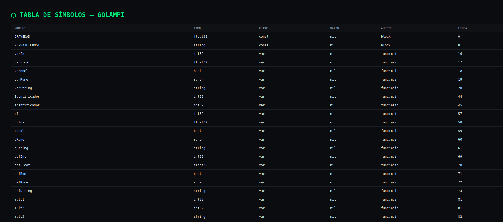

---

## Cargar y Guardar Archivos

### Cargar un archivo

1. Haga clic en el botón **Cargar** en la barra de herramientas.
2. Seleccione un archivo con extensión `.go`, `.golampi` o `.txt`.
3. El contenido del archivo reemplazará el código actual en el editor.

### 10.2 Guardar el código

1. Haga clic en **Guardar** en la barra de herramientas.
2. Se descargará automáticamente un archivo llamado `programa.golampi`.
3. El archivo puede volver a cargarse en sesiones futuras.

---

## Ejemplos de Sesión

###  Programa simple — Hola Mundo

**Código:**
```go
func main() {
    fmt.Println("¡Hola, Golampi!")
}
```

**Consola:**
```
¡Hola, Golampi!
```
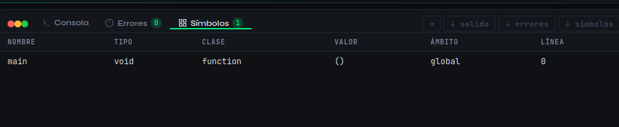

---

### Variables y operaciones

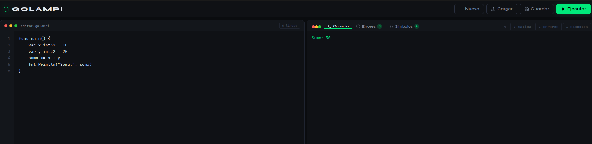

**Código:**
```go
func main() {
    var x int32 = 10
    var y int32 = 20
    suma := x + y
    fmt.Println("Suma:", suma)
}
```

**Consola:**
```
Suma: 30
```

**Tabla de símbolos:**

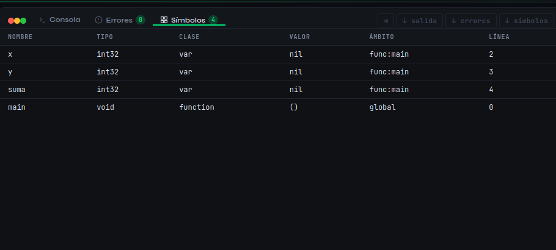
---

### Sesión con errores

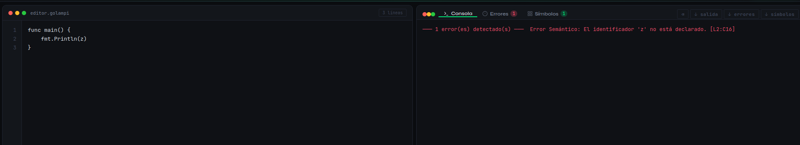

**Código con error:**
```go
func main() {
    fmt.Println(z)
}
```

**Consola:**
```
─── 1 error(es) detectado(s) ───
  Error Semántico: El identificador 'z' no está declarado. [L2:C16]
```

**Reporte de Errores:**

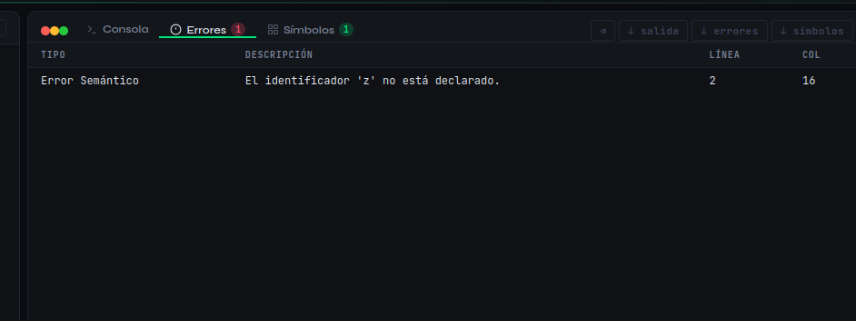
---

### Ciclo for y ámbito loop

**Código:**
```go
func main() {
    for i := 0; i < 3; i++ {
        fmt.Println("Iteración:", i)
    }
}
```

**Consola:**
```
Iteración: 0
Iteración: 1
Iteración: 2
```

**Tabla de símbolos — variable de ciclo:**

| NOMBRE | TIPO  | CLASE | VALOR | ÁMBITO | LÍNEA |
|--------|-------|-------|-------|--------|-------|
| i      | int32 | var   | 2     | loop   | 2     |

---

## Solución de Problemas

### El IDE no carga en el navegador

**Causa:** El servidor frontend no está activo.  
**Solución:** Verificar que `php -S localhost:3000` esté corriendo en la carpeta `frontend/`.

### "Error de conexión con el servidor backend"

**Causa:** El servidor backend no está activo.  
**Solución:** Verificar que `php -S localhost:8000 -t public/` esté corriendo en la carpeta `backend/`.

### El programa no produce salida

**Causa 1:** El código no tiene función `main`.  
**Solución:** Asegurarse de que exista `func main() { ... }`.

**Causa 2:** Hay errores semánticos que detienen la ejecución.  
**Solución:** Revisar la vista **Errores** y corregir los problemas indicados.

### Los cambios en el código no se reflejan

**Causa:** El navegador usa una versión cacheada del frontend.  
**Solución:** Presionar `Ctrl + Shift + R` para forzar recarga sin caché.

### Caracteres especiales no se muestran correctamente

**Causa:** Problema de codificación del archivo fuente.  
**Solución:** Asegurarse de que el archivo esté guardado en UTF-8.

---


